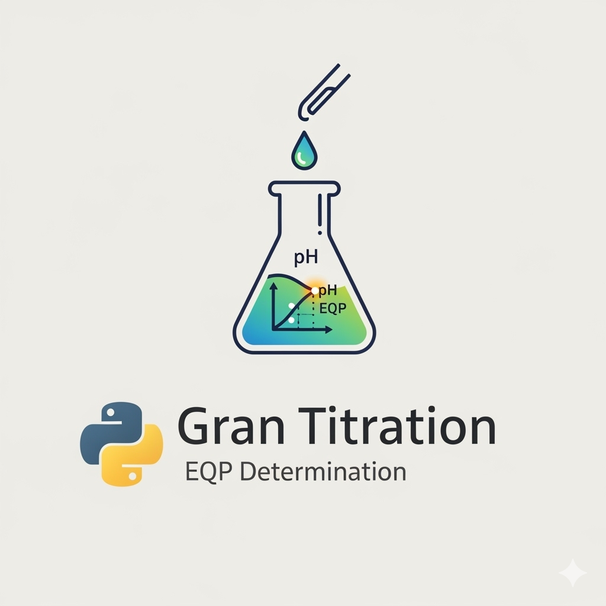

# GranTED

[](https://github.com/sgiani95/GranTED) [](https://opensource.org/licenses/Apache-2.0) [](https://pypi.org/project/GranTED/) [](https://github.com/sgiani95/GranTED/actions/workflows/tests.yml)

**GranTED** (Gran-Schwartz Titration Equivalence point Determination) is an open-source Python package for automated and robust analysis of potentiometric titration data using the Gran and Schwartz methods.

Designed with analytical and green chemistry in mind, GranTED provides reliable equivalence point detection, uncertainty estimation, and advanced diagnostic tools — particularly useful for method development, optimization, and validation of titration procedures.



---

## Features

- Automatic computation of Gran and Schwartz functions
- Robust linear region detection with R² optimization
- Schwartz k-optimization and re-identification of linear interval
- Analytical uncertainty estimation on equivalence volume (EQP)
- **Advanced method development tools**: Backward trimming analysis + earliest acceptable point detection with configurable thresholds
- High-quality, publication-ready diagnostic plots (PNG + PDF) with full-dataset insets for context
- Multiple operation modes:
  - `method_development` — full trimming + convergence analysis
  - `method_validation` / `method_application` — standard analysis
  - `method_debug` — detailed diagnostic plots
- Clean command-line interface with extensive options

---

## Installation

### from PyPI (Recommended)

```bash
pip install granted
```

### From Source (for development)

```bash
git clone https://github.com/sgiani95/GranTED.git
cd GranTED
pip install -e .
```

---

## Quick Start

```bash
# Basic usage with default settings
granted --data_file data.dat --mode method_development

# With custom thresholds for method development
granted --data_file data.dat --mode method_development \
        --veq-tolerance 0.010
```

---
